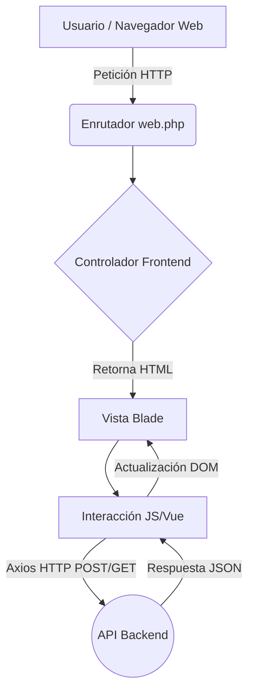

# Manual Técnico: Frontend Web

## 1. Visión General de la Arquitectura
El **Frontend** del Sistema de Carnetización está construido bajo el ecosistema de **Laravel 10** utilizando **Blade** como motor de plantillas y **Vite** para el empaquetado de assets y compilación de CSS/JS en tiempo real. Aunque la lógica de negocio y base de datos residen en el backend (API separada), este frontend se encarga del renderizado principal de las vistas y del enrutamiento de la interfaz de usuario.

El patrón arquitectónico principal seguido aquí es el de **Modelo-Vista-Controlador (MVC)** enfocado a la presentación. Los controladores del frontend manejan la solicitud de las vistas (`resources/views/`), mientras que las interacciones con el backend se realizan mediante peticiones HTTP asíncronas utilizando **Axios**.

### Diagrama de Flujo General



## 2. Configuración del Entorno de Desarrollo

### Requisitos del Sistema
- PHP >= 8.1
- Composer
- Node.js >= 18 (NPM o Yarn)

### Variables de Entorno (.env)
Las variables principales a configurar en el archivo `.env` son:
```env
APP_ENV=local
APP_DEBUG=true
APP_URL=http://localhost:3000

# Endpoint base del Backend
API_URL=http://localhost:8000
VITE_API_URL=http://localhost:8000
```

### Scripts y Dependencias
El proyecto gestiona sus dependencias tanto en `composer.json` (PHP) como en `package.json` (JS/CSS).
- **Iniciar servidor PHP local**: `php artisan serve --port=3000`
- **Iniciar compilador Vite**: `npm run dev`
- **Compilación de producción**: `npm run build`

## 3. Estructura de Carpetas

```text
control_acceso_frontend/
├── app/                  # Controladores y Middlewares del Frontend
├── bootstrap/            # Archivos de arranque del framework
├── config/               # Configuraciones globales (app, cors, auth, etc.)
├── public/               # Directorio público raíz (index.php, imágenes)
│   └── build/            # Assets compilados por Vite para producción
├── resources/
│   ├── css/              # Estilos CSS generales (Tailwind)
│   ├── js/               # Scripts JS principales y configuración de Axios
│   └── views/            # Vistas en formato Laravel Blade (.blade.php)
├── routes/
│   └── web.php           # Definición de rutas accesibles por navegador web
├── composer.json         # Dependencias PHP
├── package.json          # Dependencias Node/Vite
└── vite.config.js        # Configuración del empaquetador de assets
```

## 4. Principales Componentes y Responsabilidades
- **Enrutador (`routes/web.php`)**: Mapea las URLs del navegador a las vistas o controladores del frontend.
- **Controladores (`app/Http/Controllers`)**: Intermedian entre la ruta y la vista. Preparan cualquier dato necesario inicial antes de renderizar el Blade.
- **Vistas (`resources/views`)**: Estructura HTML final. Incluyen lógica directa mediante directivas Blade (`@if`, `@foreach`).
- **Axios (`resources/js/bootstrap.js`)**: Configurado globalmente para apuntar a `VITE_API_URL` e incluir credenciales (`withCredentials: true`), permitiendo manejar la sesión Sanctum de manera transparente.

## 5. Convenciones de Código
- **Estilos**: TailwindCSS. Se prefiere el uso de clases utilitarias directamente en los archivos Blade en lugar de CSS personalizado.
- **JS**: Modular y asíncrono. Promesas manejadas con `async/await` en lugar de `.then()`.

## 6. Proceso de Build, Test y Deploy

### Construcción (Build)
Para construir los assets estáticos minificados:
```bash
npm run build
```

### Test
Ejecutar tests unitarios (PHPUnit):
```bash
php artisan test
```
*(Nota: Cobertura actual de tests no detectada en profundidad, se recomienda verificar)*

### Despliegue (Deploy)
1. Instalar dependencias sin desarrollo: `composer install --no-dev --optimize-autoloader` y `npm install`
2. Compilar assets: `npm run build`
3. Limpiar caché: 
   ```bash
   php artisan config:cache
   php artisan view:cache
   ```
4. Configurar el Web Server (Nginx/Apache) apuntando a la carpeta `/public`.

## 7. Deudas Técnicas y Áreas de Mejora
- Faltan suites de testeo front-end exhaustivas (ej. Cypress, Jest).
- Dependencia alta de clases utilitarias en línea que podrían refactorizarse en componentes Blade reutilizables si las vistas crecen en complejidad.
- Se recomienda documentar los mixins de Tailwind personalizados si existen en el futuro.
